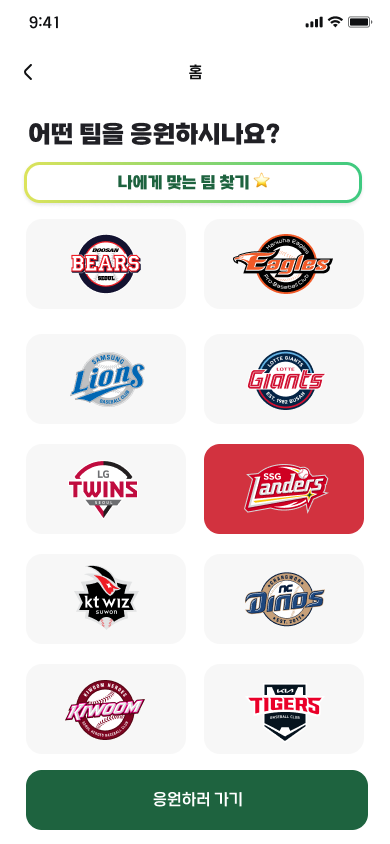

 

 

<h2>삼성 청년 SW 아카데미 11기 자율 NewBie B304</h2>

    야구 열혈팬이 되는 과정을 함께하다
    야구 초보자를 위한 웹앱 플랫폼 <strong>NewBie</strong>

 
 

## 💫 프로젝트 개요

전통적으로 야구 팬의 주류였던 **40대 이상의 남성**에서 벗어나, **20-30대 여성층** 이 새로운 팬층으로 유입되고 있습니다.

이로 인해 팬층의 다양성이 확대되었으며, 야구 규칙이나 선수 정보를 처음 접하는 초보 팬들이 증가하고 있습니다.

이에 따라 초보 팬들이 쉽게 야구를 이해하고 즐길 수 있는 서비스인 NewBie를 기획했습니다.

 

<h2> 개발 기간📅</h2>

| 개발기간 | 2024.10.12 ~ 2024.11.19 (6주) |
| -------- | ----------------------------- |

 
 

<!-- 기술 스택 -->

## 📌 주요 기능

| **기능**                        | **설명**                                                                                                                                           | **사용 기술**                                                                                                              |
| ------------------------------- | -------------------------------------------------------------------------------------------------------------------------------------------------- | -------------------------------------------------------------------------------------------------------------------------- |
| **야구 통합정보 제공**          | - 경기 일정, 결과 및 순위 제공 - 구단별 시즌 성적 및 응원가 정보 제공 - 선수단 성적, 응원가 및 정보 제공                                     | - KBO 사이트 데이터 크롤링 - 응원가 음원 추출 후 S3 연동                                                                |
| **구단 추천 및 나의 구단 설정** | - MBTI와 설문조사를 활용한 구단 추천 기능 - 나의 응원 구단 정보를 우선 제공                                                                     | - 콘텐츠 기반 필터링 기법 적용                                                                                             |
| **야구사전**                    | - 챗봇 기반의 질의응답 형식 AI 야구사전 제공                                                                                                       | - WebSocket을 활용한 실시간 채팅 - GPT API 파인튜닝으로 원활한 응답 제공                                                |
| **하이라이트 영상 제공**        | - 최근 경기 하이라이트 영상 제공 - 선수 하이라이트 영상 제공                                                                                    | - YouTube API를 활용한 쿼리 필터링                                                                                         |
| **야구 커뮤니티**               | - 자유게시판으로 유저 간 소통 공간 제공 - 굿즈, 유니폼 등의 중고거래 게시판 제공 - 게시글 작성 시 마일리지 적립 - 구단별 응원 채팅방 제공 | - Ngram Full Text Index로 빠른 검색 구현 - WebSocket을 활용한 실시간 채팅 - 욕설 필터링, 도배 방지 및 신고 기능 추가 |
| **포토카드 스토어**             | - 마일리지를 사용해 선수 포토카드 구매 - 구매한 포토카드를 보관함에 저장                                                                        | - RestTemplate을 활용한 동기 통신으로 마일리지 체크 - RabbitMQ를 사용한 비동기 통신으로 마일리지 적립 및 차감           |
| **나의 직관경기 등록**          | - 직관 경기 티켓 사진 촬영을 통해 나의 직관경기 등록 - 등록한 직관경기 이력을 보관                                                              | - OCR 분석을 통해 경기 티켓 정보 추출                                                                                      |

 

## 🛠 기술 고도화

- **Selenium을 통한 동적 크롤링**
  

- **실시간 경기 정보**
  

- **CLOVA OCR을 통한 티켓 분석**
  

 

## 📞 NewBie APP

: 사용자의 편리함을 극대화 시키는 UI/UX 구상

| 로그인 페이지                              | 홈 페이지1                                 | 홈 페이지2                                 |
| ------------------------------------------ | ------------------------------------------ | ------------------------------------------ |
|  |  |  |

| 구단상세 페이지                           | 응원송 페이지                                  | 응원채팅 페이지                                |
| ----------------------------------------- | ---------------------------------------------- | ---------------------------------------------- |
|  |  |  |

| 자유게시판 페이지                          | 중고거래 페이지                            | 포토카드스토어 페이지                          |
| ------------------------------------------ | ------------------------------------------ | ---------------------------------------------- |
|  |  |  |

| 응원팀설정 페이지                                | 야구사전 페이지                                   | 직관경기등록 페이지                            |
| ------------------------------------------------ | ------------------------------------------------- | ---------------------------------------------- |
|  |  |  |

 

  <h2>🛠 Tech Stack</h2>

<h3>Backend</h3>

    
    
    
    
    
    

<h3>Frontend</h3>

    
    
    

<h3>Data</h3>

    
    
    

<h3>Infra</h3>

    
    
    
    

<h3>Architecture</h3>

 
   
 

<h2>🧑‍ 팀원 소개</h2>

<table>
    <tr>
        <td align="center">
        
      </td>
      <td align="center">
        
      </td>
      <td align="center">
        
      </td>
      <td align="center">
        
      </td>
      <td align="center">
        
      </td>
      <td align="center">
        
      </td>
  </tr>
  <tr>
    <td align="center">
      <a href="https://github.com/hozzun">
        김호준
      </a>
    </td>
    <td align="center">
      <a href="https://github.com/gawona">
        장가원
      </a>
    </td>
    <td align="center">
      <a href="https://github.com/poow810">
        박하운
      </a>
    </td>
    <td align="center">
      <a href="https://github.com/jiwon718">
        이지원
      </a>
    </td>
    <td align="center">
      <a href="https://github.com/miryang1016">
        김미량
      </a>
    </td>
    <td align="center">
      <a href="https://github.com/yasisicoco">
        김진우
      </a>
    </td>
  </tr>
  <tr>
    <td align="center">
        팀장, BE
    </td>
    <td align="center">
      BE
    </td>
    <td align="center">
      BE
    </td>
    <td align="center">
      Infra, FE
    </td>
    <td align="center">
      FE, Data
    </td>
    <td align="center">
      FE
    </td>
  </tr>
</table>

